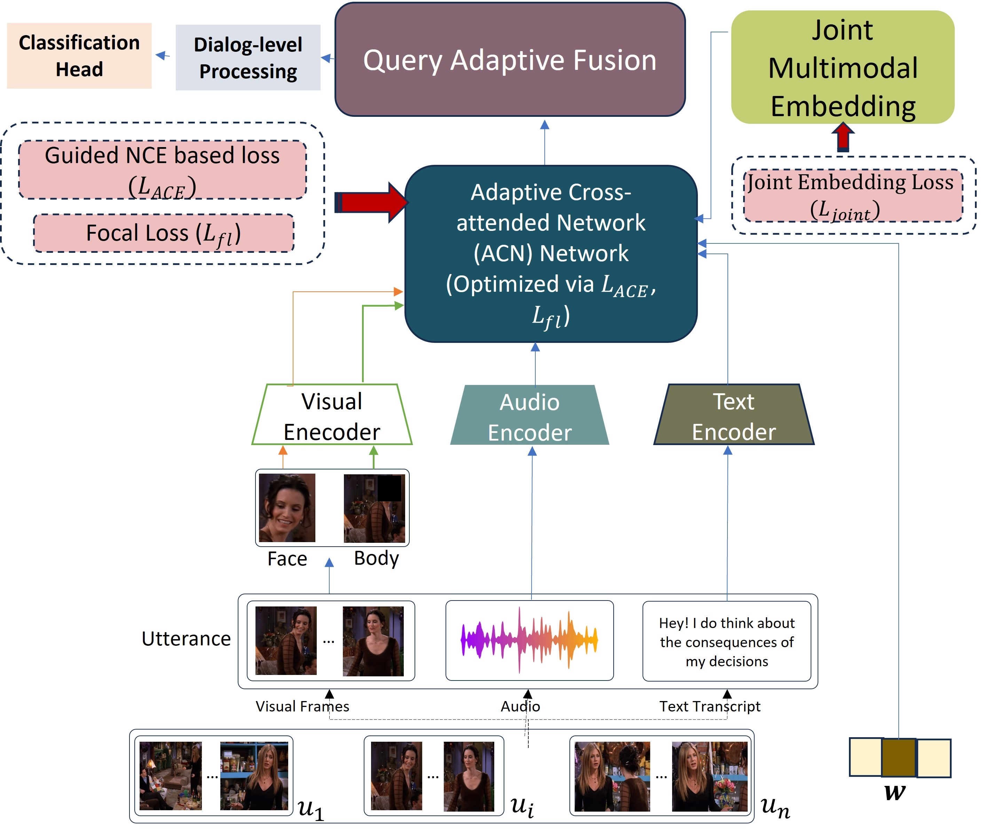
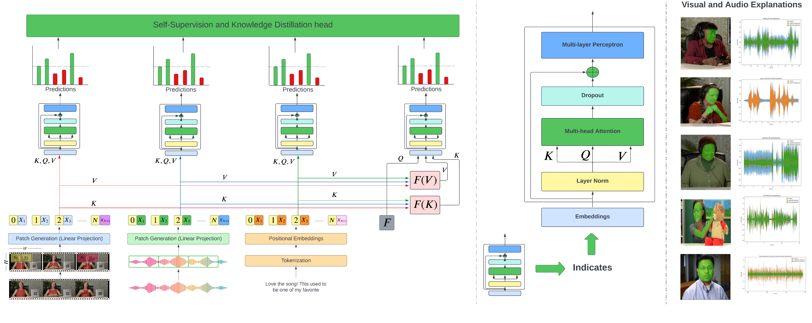
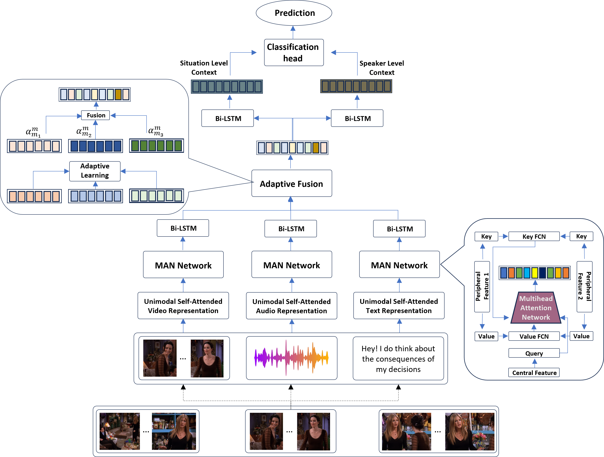
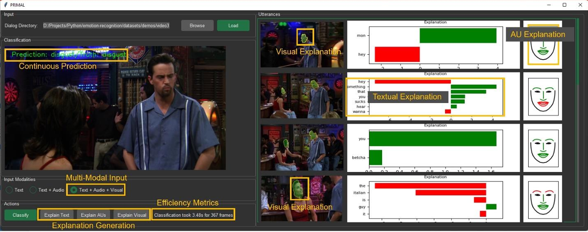

# About me

<figure markdown="1" style="margin:0 auto; text-align: center;">
{ width="200" }
</figure>

<b>Naresh Kumar Devulapally</b>

<a href="https://scholar.google.com/citations?hl=en&user=20vLrzMAAAAJ" target = "_blank">Google Scholar</a> | <a href="https://www.linkedin.com/in/nareshdevulapally" target = "_blank">LinkedIn</a> | <a href="https://github.com/neuralnaresh" target = "_blank">Github</a> | <a href="https://github.com/neuralnaresh/neuralnaresh.github.io/blob/main/docs/documents/Research-CV.pdf" target = "_blank">CV</a>

I am a Computer Science Ph.D. candidate with research interests in **Multimodal Machine Learning, Representation Learning, and Graph Embeddings.** My research advised by <a href="https://cse.buffalo.edu/~jsyuan/" target = "_blank">Dr. Junsong Yuan</a> and <a href="https://cse.buffalo.edu/~sreyasee/" target = "_blank">Dr. Sreyasee Das Bhattacharjee</a> at The Visual Computing Lab in the Department of Computer Science at the University at Buffalo, SUNY. My recent (first-author) works on Multimodal Machine Learning are published at ACM Multimedia 2023 (∼25% acceptance rate), ICME 2024, BigMM 2023 and so on.

!!! info "Research Updates"

    **Spring 2024**:

    - **🎉 <u>One Paper on Multimodal Machine Learning, accepted at ICME 2024</u>**.
    - Graduate Teaching Assistant @ (CSE 560) Data Models and Query Languages course at UB.

    <!-- 
<b>Research Updates</b>
 -->
    **Fall 2023**:

    - **🎉 <u>One Paper on Adaptive Fusion for Multimodal ML models, accepted at BigMM 2023</u>**.
    - Graduate Teaching Assistant @ (CSE 574) Machine Learning course at UB.

    **Summer 2023**:

    - **🎉 <u>One Paper on Representation Learning, Explainability in Multimodal systems, accepted at ACM Multimedia 2023</u>**.
    - Graduate Teaching Assistant @ (CSE 701) Sport Analysis using Computer Vision seminar.

    **Spring 2023**:

    - <u>Submitted two papers to ACM Multimedia 2023</u>.
    - Graduate Teaching Assistant @ (CSE 560) Data Models and Query Languages course at UB.

    **Fall 2022**:

    - <u>Submitted one paper to IJCAI 2023.</u>
    - Graduate Teaching Assistant @ (CSE 555) Introduction to Pattern Recognition at UB.

## Research Publications

<!-- 

| <a href= "#">GitHub</a> | <a href= "#">ArXiV</a> | <a href= "#">PDF</a> |

 -->

!!! info "[Adaptive Missing-Modality Emotion Recognition in Conversation via Joint Embedding Learning.](conferences/mmfp3687-anand.md)"
    <figure markdown="1" style="margin:0 auto; text-align: center;">
    { width="400" }
    </figure>
    
    
[PDF](https://arxiv.org/abs/2402.10921) | [Code](https://github.com/neuralnaresh/multimodal-emotion-recognition) | [Poster]() | [Web Page](conferences/mmfp3687-anand.md)

    

    We propose AM$^2$-EmoJE, a model for Adaptive Missing-Modality Emotion Recognition in Conversation via Joint Embedding Learning model that is grounded on two-fold contributions: First, a query adaptive fusion that can automatically learn the relative importance of its mode-specific representations in a query-specific manner. Second, the multimodal joint embedding learning module that explicitly addresses various missing modality scenarios in test-time. By reporting around 2-5% improvement in the weighted-F1 score, the proposed multimodal joint embedding module facilitates an impressive performance gain in a variety of missing-modality query scenarios during test time.
    

!!! info "[Multi-label Emotion Analysis in Conversation via Multimodal Knowledge Distillation.](conferences/mmfp3687-anand.md)"
    <figure markdown="1" style="margin:0 auto; text-align: center;">
    { width="600" }
    </figure>
    
    
[PDF](https://cse.buffalo.edu/~jsyuan/papers/2023/mmfp3687-anand.pdf) | [Code](https://github.com/neuralnaresh/multimodal-emotion-recognition) | [Poster]() | [Web Page](conferences/mmfp3687-anand.md)

    

    We present Self-supervised Multi-Label Peer Collaborative Distillation (SeMuL-PCD) Learning via an efficient Multimodal Transformer Network, in which complementary feedback from multiple mode-specific peer networks (e.g.transcript, audio, visual) are distilled into a single mode-ensembled fusion network for estimating multiple emotions simultaneously.
    

!!! info "[AMuSE: Adaptive Multimodal Analysis for Speaker Emotion Recognition in Group Conversations.](conferences/mmfp3687-anand.md)"
    <figure markdown="1" style="margin:0 auto; text-align: center;">
    { width="600" }
    </figure>
    
    
[PDF](https://arxiv.org/abs/2401.15164) | [Code](https://github.com/neuralnaresh/multimodal-emotion-recognition) | [Poster]() | [Web Page](conferences/mmfp3687-anand.md)

    

    We propose a Multimodal Attention Network (MAN) that captures cross-modal interactions at various levels of spatial abstraction by jointly learning its interactive bunch of mode-specific Peripheral and Central networks. The proposed MAN “injects” cross-modal attention via its Peripheral key-value pairs within each layer of a mode-specific Central query network. The resulting cross-attended mode-specific descriptors are then combined using an Adaptive Fusion (AF) technique that enables the model to integrate the  discriminative and complementary mode-specific data patterns within an instance-specific multimodal descriptor.
    

!!! info "[Privacy-preserving Multi-modal Attentive Learning framework for real-time emotion tracking in conversations.](conferences/mmfp3687-anand.md)"
    <figure markdown="1" style="margin:0 auto; text-align: center;">
    { width="600" }
    </figure>
    
    
[PDF](https://github.com/neuralnaresh/neuralnaresh.github.io/blob/main/docs/documents/primal.pdf) | [Code](https://github.com/neuralnaresh/multimodal-emotion-recognition) | [Poster]() | [Web Page](conferences/mmfp3687-anand.md)

    

    We propose a PRIvacy-preserving Multimodal Attentive Learning framework (PRIMAL) that derives the person-independent normalized facial Action-Unit based features to estimate the participants’ expression and keep track of their spatiotemporal states and conversation dynamics in the context of their surrounding environment to evaluate the speaker's emotion. By designing a novel contrastive loss-based optimization framework to capture the self- and cross-modal correlation within a learned descriptor, PRIMAL exhibits promise in accurately identifying the emotional state of an individual speaker in group conversations.
    

---
## Academic Projects

Projects are done as a part of the courses at UB.
